# Máquina Oopsie

### Puertos abiertos

sudo nmap -sS --min-rate 6000 -p- --open -vvv -Pn 10.129.130.140

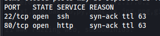

### Servicios y versiones

sudo nmap -sVC --min-rate 6000 -p22,80 -vvv -Pn 10.129.130.140

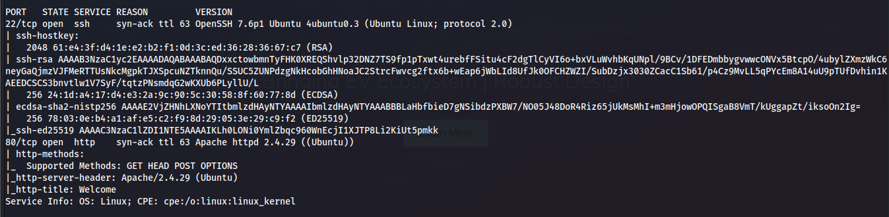

### Fuzzing web

gobuster dir -t 200 -u http://10.129.130.140/ -w /usr/share/wordlists/dirbuster/directory-list-2.3-medium.txt -x php,txt,bak,sh,py,js,html,db,png,jpg,git -b 403,404 2>/dev/null

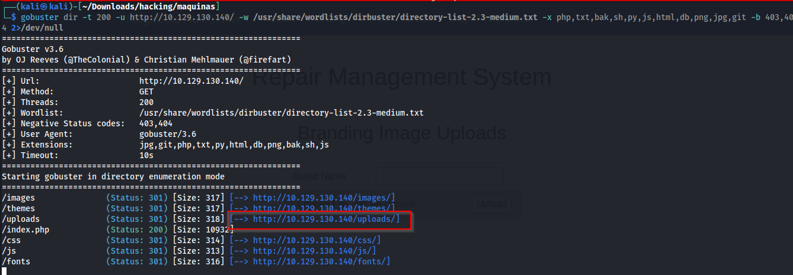

### Burp suite

Interceptamos la petición con burpsuite

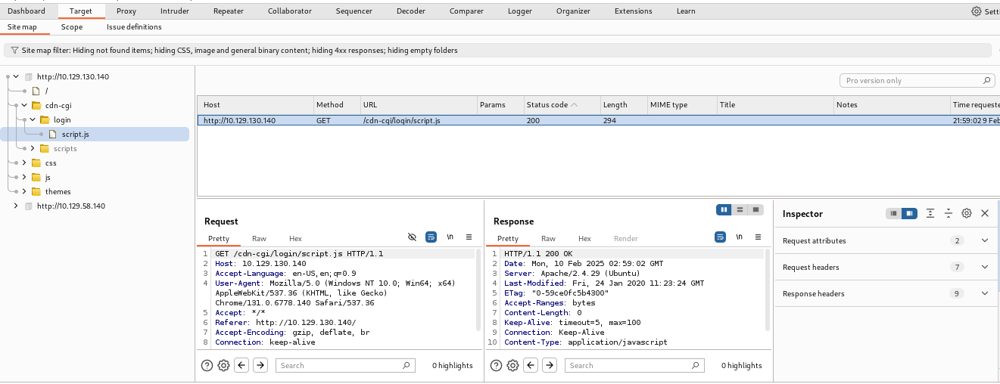

entonces entramos a: http://10.129.130.140/cdn-cgi/login/ e iniciamos sesión como guest (invitado)

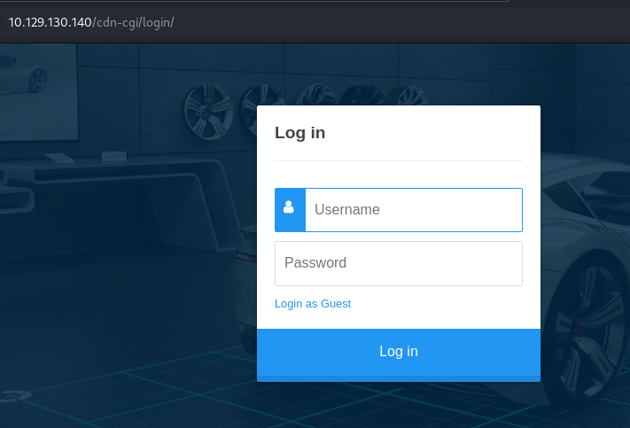

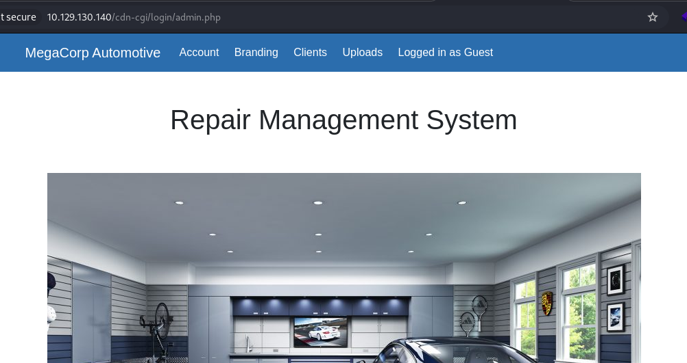

modificamos la cookie

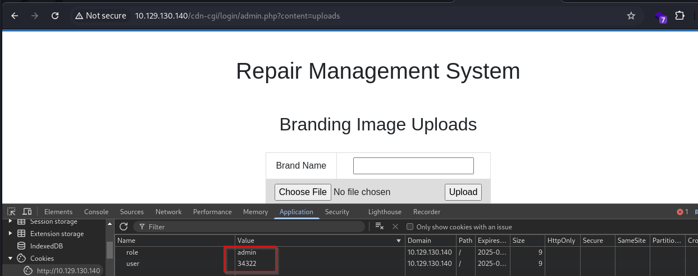

### Intrusión

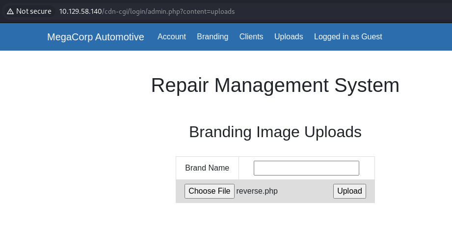

me puse en escucha con netcat:

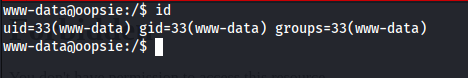

vi los usuarios del sistema:

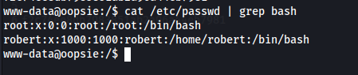

en /var/www/html/cdn-cgi/login vi un archivo db.php

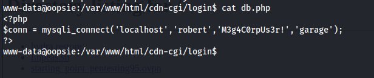

cambie al usuario robert:

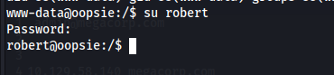

El usuario robert pertenece al grupo bugtracker. Veamos qué ficheros podemos ejecutar por ser miembros de este grupo:

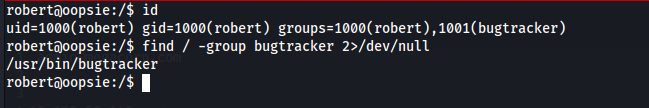

### Escalar privilegios

al ejecutar el binario:

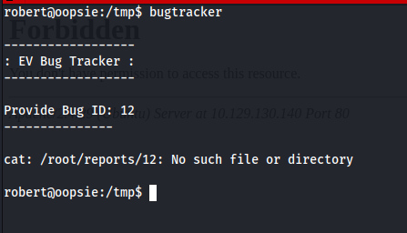

entonces hice lo siguiente

el archivo cat contiene lo siguiente:

/bin/sh

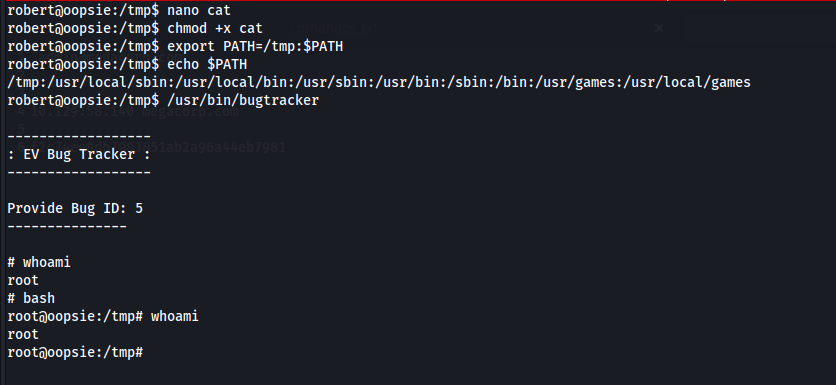